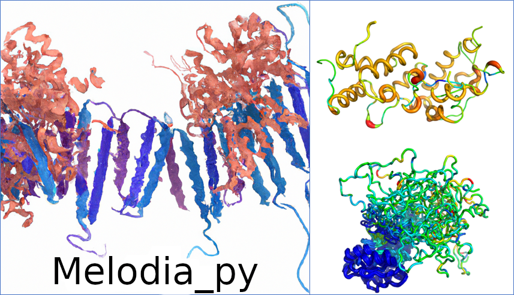

# Melodia_py
## Protein Structure Analysis

**Melodia_py** is a Python library for computing Differential Geometry
and Knot Theory descriptors of protein structures. 

## Installation
1. Open the terminal.
2. Run `pip install melodia-py` for the installation.

## Installation in [Anaconda Python](https://www.anaconda.com/products/individual)

We recommend using [Miniforge](https://github.com/conda-forge/miniforge) and Mamba for installation (optional). 
Miniforge is an Anaconda Python-compatible distribution with a faster and more reliable package manager (Mamba).
It is as simple to install as the Anaconda distribution. 

We start with creation of a new environment for **Melodia_py**.

```shell
conda create -n melodia_py
```
or (optionally, but highly recommended) replace conda for Miniforge's mamba command.

```shell
mamba create -n melodia_py
```
Next step is to activate the Melodia_py environment

```shell
conda activate melodia_py
pip install melodia-py
```
Or for building and installing **Melodia_py** for source. The first step is to clone Melodia_py's repository.
```shell
git clone https://github.com/rwmontalvao/Melodia.git
cd ./Melodia_py
```
```shell
conda env create -f environment.yml
conda activate melodia_py
```

```shell
python setup.py install
```

## Documentation
The *examples* folder contains Jupyter Notebooks, with tutorials explaining **Melodia_py's** functionalities. 
* Getting Started: 
[](https://colab.research.google.com/github/rwmontalvao/Melodia_py/blob/main/examples/01_getting_started.ipynb)
* Alignment Basics:
[](https://colab.research.google.com/github/rwmontalvao/Melodia_py/blob/main/examples/02_alignment_basics.ipynb)
* Basic Similarity Analysis:
 [](https://colab.research.google.com/github/rwmontalvao/Melodia_py/blob/main/examples/03_basic_similarity_analysis.ipynb)
* Advanced Similarity Analysis:
[](https://colab.research.google.com/github/rwmontalvao/Melodia_py/blob/main/examples/04_advanced_similarity_analysis.ipynb)
* Machine Leaning Ensemble Analysis:
[](https://colab.research.google.com/github/rwmontalvao/Melodia_py/blob/main/examples/05_Machine_Learning_ensemble_analysis.ipynb)
* Alignment Clustering and PDB Superimposition:
[](https://colab.research.google.com/github/rwmontalvao/Melodia_py/blob/main/examples/06_alignment_clustering_and_superimposition.ipynb)

### Authors
- Rinaldo W. Montalvão, PhD
- Antonio Marinho da Silva Neto, PhD
- William R. Pitt, PhD

### References
- Montalvão R, Smith R, Lovell S, Blundell T: CHORAL: a differential geometry approach to the prediction of the cores of protein structures. Bioinformatics. 2005, 21: 3719-3725.
- Chang PL, Rinne AW, Dewey TG: Structure alignment based on coding of local geometric measures. BMC Bioinformatics. 2006, 7:346.
- Leung H, Montaño B, Blundell T, Vendruscolo M, Montalvão R: ARABESQUE: A tool for protein structural comparison using differential geometry and knot theory. World Res J Peptide Protein. 2012, 1: 33-40.
- Pitt WR, Montalvão R, Blundell T: Polyphony: superposition independent methods for ensemble-based drug discovery. BMC Bioinformatics. 2014, 15:324 
- Marinho da Silva Neto A, Reghim Silva S, Vendruscolo M, Camilloni C, Montalvão R: A Superposition Free Method for Protein Conformational Ensemble Analyses and Local Clustering Based on a Differential Geometry Representation of Backbone. Proteins: Structure, Function, and Bioinformatics. 2018, 87(4):302-312
- Marinho da Silva Neto A, Montalvão R, Gondim Martins DB, Lima Filho JL, Madeiros Castelletti CH: A model of key residues interactions for HPVs E1 DNA binding domain-DNA interface based on HPVs residues conservation profiles and molecular dynamics simulations, Journal of Biomolecular Structure and Dynamics. 2019, 38(12):3720-3729.
